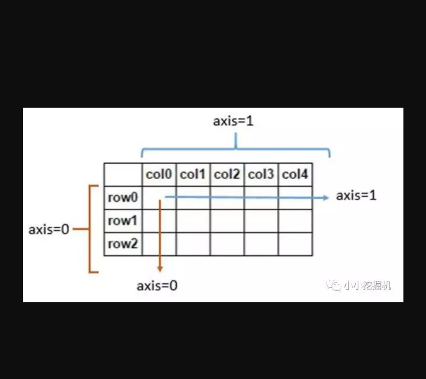

# Pandas

<!-- TOC -->

- [Pandas](#pandas)
- [一、数据结构](#一数据结构)
    - [1.Series](#1series)
        - [1.1创建](#11创建)
            - [列表创建](#列表创建)
            - [字典创建](#字典创建)
        - [1.2特性](#12特性)
            - [索引](#索引)
            - [切片](#切片)
            - [重新索引](#重新索引)
            - [数据运算](#数据运算)
            - [排序和排名](#排序和排名)
            - [汇总和计算描述统计](#汇总和计算描述统计)
            - [唯一数、值计数](#唯一数值计数)
            - [处理缺失数据](#处理缺失数据)
    - [2.DataFrame](#2dataframe)
        - [2.1创建](#21创建)
            - [字典创建](#字典创建-1)
            - [读取文件](#读取文件)
        - [2.2轴的概念](#22轴的概念)
        - [2.3性质](#23性质)
            - [索引、切片](#索引切片)
            - [修改数据](#修改数据)
            - [重新索引](#重新索引-1)
            - [丢弃指定轴上的值](#丢弃指定轴上的值)
            - [算数运算](#算数运算)
            - [函数的应用和映射](#函数的应用和映射)
            - [排序和排名](#排序和排名-1)
            - [汇总和计算描述统计](#汇总和计算描述统计-1)
            - [处理缺失数据](#处理缺失数据-1)
            - [层次化索引](#层次化索引)
- [二、常用方法](#二常用方法)
    - [1.合并数据集](#1合并数据集)
        - [1.1数据库风格合并](#11数据库风格合并)
        - [1.2轴向链接](#12轴向链接)
    - [2.重塑和轴向旋转](#2重塑和轴向旋转)
    - [3.数据转换](#3数据转换)
        - [3.1移除重复数据](#31移除重复数据)
        - [3.2map函数](#32map函数)
        - [3.3replace值替换](#33replace值替换)
        - [3.4离散化和面元划分](#34离散化和面元划分)
        - [3.5排列和随机采样](#35排列和随机采样)
    - [4.数据聚合](#4数据聚合)
        - [4.1数据分组](#41数据分组)
            - [Series](#series)
            - [合适长度的数组](#合适长度的数组)
            - [列名](#列名)
            - [map](#map)
        - [4.2数据聚合操作](#42数据聚合操作)
            - [特定聚合操作](#特定聚合操作)
            - [transform函数](#transform函数)
        - [4.3数据透视表](#43数据透视表)

<!-- /TOC -->
-----------------------
# 一、数据结构
pandas中主要有两种数据结构，分别是：Series和DataFrame。
>* Series：一种类似于一维数组的对象，是由一组数据(各种NumPy数据类型)以及一组与之相关的数据标签(即索引)组成。仅由一组数据也可产生简单的Series对象。注意：Series中的索引值是可以重复的。
>* DataFrame：一个表格型的数据结构，包含有一组有序的列，每列可以是不同的值类型(数值、字符串、布尔型等)，DataFrame即有行索引也有列索引，可以被看做是由Series组成的字典。
## 1.Series
### 1.1创建
#### 列表创建
pandas有两种主要的数据结构，第一种是Series，是一种类似于一维数组的数据结构，它由一组数据以及一组与之相关的数据标签组成。我们可以直接根据list来生成一个Series。
```
obj = pd.Series([4,7,-5,3])
obj

#输出
0    4
1    7
2   -5
3    3
dtype: int64
```
可以通过index和values属性来获得obj的索引和值
```
obj.index
#RangeIndex(start=0, stop=4, step=1)
obj.values
#array([ 4,  7, -5,  3])

索引在默认情况下是0-n-1，不过我们可以指定索引的值
obj2 = pd.Series([4,7,-5,3],index=['d','b','a','c'])
obj2

#输出
d    4
b    7
a   -5
c    3
dtype: int64
```
#### 字典创建
可以直接通过字典dict来创建Series，此时字典>中的键作为索引，字典中的值作为对应的值
```
sdata = {'Ohio':35000,'Texas':71000,'Oregon':16000,'Utah':5000}
obj3 = pd.Series(sdata)
obj3 
#输出
Ohio      35000
Oregon    16000
Texas     71000
Utah       5000
dtype: int64
```

如果既使用了字典，又指定了索引，那么字典中跟索引相匹配的值将会被找出来放到相应的位置上:
```
states = ['California','Ohio','Texas','Oregon']
obj4 = pd.Series(sdata,index = states)
obj4
#输出
California        NaN
Ohio          35000.0
Texas         71000.0
Oregon        16000.0
dtype: float64
```
### 1.2特性
#### 索引
可以通过相对位置的下标或者index来访问Series中的元素
```
obj2[2]
#-5

obj2['a']
#-5

obj2[\['a','b','d']]
#输出
a   -5
b    7
d    4
dtype: int64
```
#### 切片
与利用下标进行切片不同，使用标签进行切片时，末端是包含的：
```
obj['b':'c']
#输出
b    1.0
c    2.0
dtype: float64
```
#### 重新索引
我们可以使用reindex函数对Series进行重新索引，而不是简单的改变索引的值：
```
obj2 = pd.Series([4,7,-5,3],index=['d','b','a','c'])
obj3 = obj2.reindex(['a','b','c','d','e'])
obj3
#输出
a   -5.0
b    7.0
c    3.0
d    4.0
e    NaN
dtype: float64
```
可以看到，使用reindex时，如果新增 的索引在原数据中没有值，其对应的值就会是NA，此时我们可以使用fill_value属性对数据进行填充：
```
obj4 = obj2.reindex(['a','b','c','d','e'],fill_value=0)
obj4
#输出
a   -5
b    7
c    3
d    4
e    0
dtype: int64
```
reindex函数还有一个method属性，进行差值填充，但是索引必须是单调递增或者单调递减的，所以一般用在时间序列这样的有序数据中：

```
# obj5 = obj2.reindex(['a','b','c','d','e'],method='ffill') 会报错
obj3 = pd.Series(['blue','Purple','yellow'],index = [0,2,4])
obj3.reindex(range(6),method='ffill')
#输出
0      blue
1      blue
2    Purple
3    Purple
4    yellow
5    yellow
dtype: object
```
#### 数据运算
可以对Series进行numpy中的一些数组运算（如根据布尔型数据进行过滤，标量乘法、应用数学函数等），这些都会保留索引和值之间的链接
```
np.exp(obj2)
#输出
d      54.598150
b    1096.633158
a       0.006738
c      20.085537
dtype: float64
```
可以把Series看成是一个定长的有序字典，因为他是索引值到数据值的一个映射，它可以用在许多原本需要字典参数的函数中
```
b' in obj2
#True
```
Series最重要的一个功能是：它在算术运算中会自动对齐不同索引的数据：
```
obj3 + obj4
#输出
California         NaN
Ohio           70000.0
Oregon         32000.0
Texas         142000.0
Utah               NaN
dtype: float64
```

#### 排序和排名
sort_index按照索引进行排序，返回一个新的对象
```
obj = pd.Series(range(4),index=['d','a','b','c'])
obj.sort_index()
#输出：
a    1
b    2
c    3
d    0
dtype: int64
```
sort_values根据列值进行排序
```
obj.sort_values()
#输出：
d    0
a    1
b    2
c    3
dtype: int64
```

使用rank函数会增加一个排名值，从1开始，一直到数组中有效数据的数量，对于平级关系，rank是通过为各组分配一个平均排名的方式破坏平级关系的，如果不想使用这个平均值，可以使用method参数按照指定的方式进行rank排序，例如使用first可以按值在原始数据中出现顺序分配排名：

```
obj = pd.Series([7,-5,7,4,2,0,4])
obj.rank()
#输出：
0    6.5
1    1.0
2    6.5
3    4.5
4    3.0
5    2.0
6    4.5
dtype: float64

obj.rank(method='first')
#输出
0    6.0
1    1.0
2    7.0
3    4.0
4    3.0
5    2.0
6    5.0
dtype: float64
```
#### 汇总和计算描述统计
Series中的实现了sum、mean、max等方法，这里就不详细介绍了，我们主要介绍求协方差和相关系数的方法：Series的corr方法用于计算两个Series中重叠的，非NA的，按索引对齐的值的相关系数，与此类似，cov用于计算协方差。

```
obj1 = pd.Series(np.arange(10),index = list('abcdefghij'))
obj2 = pd.Series(np.arange(12),index = list('cdefghijklmn'))
obj1.corr(obj2)
#1.0
obj1.cov(obj2)
#6.0
```
#### 唯一数、值计数

unique返回没有排序的唯一值数组,value_counts()返回各数的计数
```
obj = pd.Series(['c','a','d','a','a','b','b','c','c'])
uniques = obj.unique()
uniques
#array(['c', 'a', 'd', 'b'], dtype=object)

#value_counts()返回各数的计数
obj.value_counts()
#输出
a    3
c    3
b    2
d    1
dtype: int64
```
#### 处理缺失数据
Pandas中缺失值相关的方法主要有以下三个：
isnull方法用于判断数据是否为空数据；
fillna方法用于填补缺失数据；
dropna方法用于舍弃缺失数据。
上面两个方法返回一个新的Series或者DataFrame，对原数据没有影响,如果想在原数据上进行直接修改，使用inplace参数
```
data = pd.Series([1,np.nan,3.5,np.nan,7])
data.fillna(0)
#输出
0    1.0
1    0.0
2    3.5
3    0.0
4    7.0
dtype: float64
```
## 2.DataFrame
DataFrame是一种表格型数据结构，它含有一组有序的列，每列可以是不同的值。DataFrame既有行索引，也有列索引，它可以看作是由Series组成的字典，不过这些Series公用一个索引。
DataFrame的创建有多种方式，不过最重要的还是根据dict进行创建，以及读取csv或者txt文件来创建。这里主要介绍这两种方式。

### 2.1创建
#### 字典创建
```
data = {
    'state':['Ohio','Ohio','Ohio','Nevada','Nevada'],
    'year':[2000,2001,2002,2001,2002],
    'pop':[1.5,1.7,3.6,2.4,2.9]
}
frame = pd.DataFrame(data)
frame

#输出
    pop state   year
0   1.5 Ohio    2000
1   1.7 Ohio    2001
2   3.6 Ohio    2002
3   2.4 Nevada  2001
4   2.9 Nevada  2002
```
DataFrame的行索引是index，列索引是columns，我们可以在创建DataFrame时指定索引的值：
```
frame2 = pd.DataFrame(data,index=['one','two','three','four','five'],columns=['year','state','pop','debt'])
frame2

#输出
    year    state   pop debt
one 2000    Ohio    1.5 NaN
two 2001    Ohio    1.7 NaN
three   2002    Ohio    3.6 NaN
four    2001    Nevada  2.4 NaN
five    2002    Nevada  2.9 NaN
```
使用嵌套字典也可以创建DataFrame，此时外层字典的键作为列，内层键则作为索引:
```
pop = {'Nevada':{2001:2.4,2002:2.9},'Ohio':{2000:1.5,2001:1.7,2002:3.6}}
frame3 = pd.DataFrame(pop)
frame3
#输出
    Nevada  Ohio
2000    NaN 1.5
2001    2.4 1.7
2002    2.9 3.6
```
我们可以用index，columns，values来访问DataFrame的行索引，列索引以及数据值，数据值返回的是一个二维的ndarray

```
frame2.values
#输出
array([[2000, 'Ohio', 1.5, 0],
       [2001, 'Ohio', 1.7, 1],
       [2002, 'Ohio', 3.6, 2],
       [2001, 'Nevada', 2.4, 3],
       [2002, 'Nevada', 2.9, 4]], dtype=object)
```
#### 读取文件
读取文件生成DataFrame最常用的是read_csv,read_table方法。该方法中几个重要的参数如下所示：
参数|描述
--|--
header|默认第一行为columns，如果指定header=None，则表明没有索引行，第一行就是数据
index_col|默认作为索引的为第一列，可以设为index_col为-1，表明没有索引列
nrows|表明读取的行数
sep或delimiter|分隔符，read_csv默认是逗号，而read_table默认是制表符\t
encoding|编码格式
其他创建DataFrame的方式有很多，比如我们可以通过读取mysql或者mongoDB来生成，也可以读取json文件等等，这里就不再介绍。

### 2.2轴的概念
在DataFrame的处理中经常会遇到轴的概念，这里先给大家一个直观的印象，我们所说的axis=0即表示沿着每一列或行标签\索引值向下执行方法，axis=1即表示沿着每一行或者列标签模向执行对应的方法。

### 2.3性质
#### 索引、切片
索引、切片
我们可以根据列名来选取一列，返回一个Series:
```
frame2['year']
#输出
one      2000
two      2001
three    2002
four     2001
five     2002
Name: year, dtype: int64
```
选取多列或者多行：
```
data = pd.DataFrame(np.arange(16).reshape((4,4)),
index = ['Ohio','Colorado','Utah','New York'],
columns=['one','two','three','four'])
data[['two','three']]
#输出
    two three
Ohio    1   2
Colorado    5   6
Utah    9   10
New York    13  14

#取行
data[:2]
#输出
    one two three   four
Ohio    0   1   2   3
Colorado    4   5   6   7
```
根据逻辑条件来选取
```
data[data['three']>5]
#输出
    one two three   four
Colorado    4   5   6   7
Utah    8   9   10  11
New York    12  13  14  15
```
pandas提供了专门的用于索引DataFrame的方法，即使用ix方法进行索引,不过ix在最新的版本中已经被废弃了，如果要是用标签，最好使用loc方法，如果使用下标，最好使用iloc方法：
```
#data.ix['Colorado',['two','three']]
data.loc['Colorado',['two','three']]
#输出
two      5
three    6
Name: Colorado, dtype: int64

data.iloc[0:3,2]
#输出
Ohio         2
Colorado     6
Utah        10
Name: three, dtype: int64
```

#### 修改数据
可以使用一个标量修改DataFrame中的某一列，此时这个标量会广播到DataFrame的每一行上:

```
data = {
    'state':['Ohio','Ohio','Ohio','Nevada','Nevada'],
    'year':[2000,2001,2002,2001,2002],
    'pop':[1.5,1.7,3.6,2.4,2.9]
}
frame2 = pd.DataFrame(data,index=['one','two','three','four','five'],columns=['year','state','pop','debt'])
frame2
frame2['debt']=16.5
frame2
#输出
year    state   pop debt
one 2000    Ohio    1.5 16.5
two 2001    Ohio    1.7 16.5
three   2002    Ohio    3.6 16.5
four    2001    Nevada  2.4 16.5
five    2002    Nevada  2.9 16.5
```
使用一个列表来修改，不过要保证列表的长度与DataFrame长度相同
```
frame2.debt = np.arange(5)
frame2
#输出
    year    state   pop debt
one 2000    Ohio    1.5 0
two 2001    Ohio    1.7 1
three   2002    Ohio    3.6 2
four    2001    Nevada  2.4 3
five    2002    Nevada  2.9 4
```
可以使用一个Series，此时会根据索引进行精确匹配：
```
val = pd.Series([-1.2,-1.5,-1.7],index=['two','four','five'])
frame2['debt'] = val
frame2
#输出
    year    state   pop debt
one 2000    Ohio    1.5 NaN
two 2001    Ohio    1.7 -1.2
three   2002    Ohio    3.6 NaN
four    2001    Nevada  2.4 -1.5
five    2002    Nevada  2.9 -1.7
```
#### 重新索引
使用reindex方法对DataFrame进行重新索引。对DataFrame进行重新索引，可以重新索引行，列或者两个都修改，如果只传入一个参数，则会从新索引行：
```
frame = pd.DataFrame(np.arange(9).reshape((3,3)),index=[1,4,5],columns=['Ohio','Texas','California'])
frame2 = frame.reindex([1,2,4,5])
frame2
#输出
    Ohio    Texas   California
1   0.0 1.0 2.0
2   NaN NaN NaN
4   3.0 4.0 5.0
5   6.0 7.0 8.0

states = ['Texas','Utah','California']
frame.reindex(columns=states)
#输出
    Texas   Utah    California
1   1   NaN 2
4   4   NaN 5
5   7   NaN 8
```
填充数据只能按行填充，此时只能对行进行重新索引：
```
frame = pd.DataFrame(np.arange(9).reshape((3,3)),index = ['a','c','d'],columns = ['Ohio','Texas','California'])
frame.reindex(['a','b','c','d'],method = 'bfill')
#frame.reindex(['a','b','c','d'],method = 'bfill',columns=states) 报错
```
#### 丢弃指定轴上的值
可以使用drop方法丢弃指定轴上的值，不会对原DataFrame产生影响
```
frame = pd.DataFrame(np.arange(9).reshape((3,3)),index = ['a','c','d'],columns = ['Ohio','Texas','California'])
frame.drop('a') 
#输出
Ohio    Texas   California
a   0   1   2
c   3   4   5
d   6   7   8

frame.drop(['Ohio'],axis=1)
#输出
    Texas   California
a   1   2
c   4   5
d   7   8
```
#### 算数运算
DataFrame在进行算术运算时会进行补齐，在不重叠的部分补足NA：
```
df1 = pd.DataFrame(np.arange(9).reshape((3,3)),columns=list('bcd'),index=['Ohio','Texas','Colorado'])
df2 = pd.DataFrame(np.arange(12).reshape((4,3)),columns = list('bde'),index=['Utah','Ohio','Texas','Oregon'])
df1 + df2
#输出
    b   c   d   e
Colorado    NaN NaN NaN NaN
Ohio    3.0 NaN 6.0 NaN
Oregon  NaN NaN NaN NaN
Texas   9.0 NaN 12.0    NaN
Utah    NaN NaN NaN NaN
```
使用fill_value方法填充NA数据，不过两个df中都为NA的数据，该方法不会填充：
```
df1.add(df2,fill_value=0)
#输出
    b   c   d   e
Colorado    6.0 7.0 8.0 NaN
Ohio    3.0 1.0 6.0 5.0
Oregon  9.0 NaN 10.0    11.0
Texas   9.0 4.0 12.0    8.0
Utah    0.0 NaN 1.0 2.0
```

#### 函数的应用和映射
numpy的元素级数组方法，也可以用于操作Pandas对象:
```
frame = pd.DataFrame(np.random.randn(3,3),columns=list('bcd'),index=['Ohio','Texas','Colorado'])
np.abs(frame)
#输出
    b   c   d
Ohio    0.367521    0.232387    0.649330
Texas   3.115632    1.415106    2.093794
Colorado    0.714983    1.420871    0.557722
```
另一个常见的操作是，将函数应用到由各列或行所形成的一维数组上。DataFrame的apply方法即可实现此功能。
```
f = lambda x:x.max() - x.min()
frame.apply(f)
#输出
b    3.830616
c    2.835978
d    2.743124
dtype: float64

frame.apply(f,axis=1)
#输出
Ohio        1.016851
Texas       4.530739
Colorado    2.135855
dtype: float64

def f(x):
    return pd.Series([x.min(),x.max()],index=['min','max'])
frame.apply(f)
#输出
    b   c   d
min -0.714983   -1.415106   -0.649330
max 3.115632    1.420871    2.093794
```
元素级的Python函数也是可以用的,使用applymap方法:
```
format = lambda x:'%.2f'%x
frame.applymap(format)
#输出
b   c   d
Ohio    0.37    -0.23   -0.65
Texas   3.12    -1.42   2.09
Colorado    -0.71   1.42    -0.56
```
#### 排序和排名
对于DataFrame,sort_index可以根据任意轴的索引进行排序，并指定升序降序
```
frame = pd.DataFrame(np.arange(8).reshape((2,4)),index=['three','one'],columns=['d','a','b','c'])
frame.sort_index()
#输出
    d   a   b   c
one 4   5   6   7
three   0   1   2   3

frame.sort_index(1,ascending=False)
#输出
d  c  b  a
three  0  3  2  1
one    4  7  6  5
```
DataFrame也可以按照值进行排序：
```
#按照任意一列或多列进行排序
frame.sort_values(by=['a','b'])
#输出
    d   a   b   c
three   0   1   2   3
one 4   5   6   7
```
#### 汇总和计算描述统计
DataFrame中的实现了sum、mean、max等方法,我们可以指定进行汇总统计的轴，同时，也可以使用describe函数查看基本所有的统计项：

```
df = pd.DataFrame([[1.4,np.nan],[7.1,-4.5],[np.nan,np.nan],[0.75,-1.3]],index=['a','b','c','d'],columns=['one','two'])
df.sum(axis=1)
#输出
one    9.25
two   -5.80
dtype: float64

#Na会被自动排除，可以使用skipna选项来禁用该功能
df.mean(axis=1,skipna=False)
#输出
a      NaN
b    1.300
c      NaN
d   -0.275
dtype: float64
#idxmax返回间接统计，是达到最大值的索引

df.idxmax()
#输出
one    b
two    d
dtype: object

#describe返回的是DataFrame的汇总统计
#非数值型的与数值型的统计返回结果不同
df.describe()
#输出
one two
count   3.000000    2.000000
mean    3.083333    -2.900000
std 3.493685    2.262742
min 0.750000    -4.500000
25% 1.075000    -3.700000
50% 1.400000    -2.900000
75% 4.250000    -2.100000
max 7.100000    -1.300000
```
DataFrame也实现了corr和cov方法来计算一个DataFrame的相关系数矩阵和协方差矩阵，同时DataFrame也可以与Series求解相关系数。
```
frame1 = pd.DataFrame(np.random.randn(3,3),index=list('abc'),columns=list('abc'))
frame1.corr
#输出
<bound method DataFrame.corr of           a         b         c
a  1.253773  0.429059  1.535575
b -0.113987 -2.837396 -0.894469
c -0.548208  0.834003  0.994863>

frame1.cov()
#输出
a   b   c
a   0.884409    0.357304    0.579613
b   0.357304    4.052147    2.442527
c   0.579613    2.442527    1.627843

#corrwith用于计算每一列与Series的相关系数
frame1.corrwith(frame1['a'])
#输出
a    1.000000
b    0.188742
c    0.483065
dtype: float64
```
#### 处理缺失数据
Pandas中缺失值相关的方法主要有以下三个：
isnull方法用于判断数据是否为空数据；
fillna方法用于填补缺失数据；
dropna方法用于舍弃缺失数据。
上面两个方法返回一个新的Series或者DataFrame，对原数据没有影响,如果想在原数据上进行直接修改，使用inplace参数：
```
data = pd.DataFrame([[1,6.5,3],[1,np.nan,np.nan],[np.nan,np.nan,np.nan],[np.nan,6.5,3]])
data.dropna()
#输出
    0   1   2
0   1.0 6.5 3.0
```
对DataFrame来说，dropna方法如果发现缺失值，就会进行整行删除，不过可以指定删除的方式，how=all，是当整行全是na的时候才进行删除,同时还可以指定删除的轴。
```
data.dropna(how='all',axis=1,inplace=True)
data
#输出
0   1   2
0   1.0 6.5 3.0
1   1.0 NaN NaN
2   NaN NaN NaN
3   NaN 6.5 3.0
```
DataFrame填充缺失值可以统一填充，也可以按列填充，或者指定一种填充方式：

```
data.fillna({1:2,2:3})
#输出
0   1   2
0   1.0 6.5 3.0
1   1.0 2.0 3.0
2   NaN 2.0 3.0
3   NaN 6.5 3.0

data.fillna(method='ffill')
#输出
0   1   2
0   1.0 6.5 3.0
1   1.0 6.5 3.0
2   1.0 6.5 3.0
3   1.0 6.5 3.0
```
#### 层次化索引
层次化索引是pandas的一项重要功能，它能使你在一个轴上有多个索引级别，也就是说，它能使你以低维度形式处理高维度数据，比如下面的代码：
```
data = pd.Series(np.random.randn(10),index=[['a','a','a','b','b','b','c','c','d','d'],[1,2,3,1,2,3,1,2,2,3]])
data

#输出
a  1    0.497970
   2   -0.042377
   3   -0.018719
b  1    0.061412
   2   -1.313888
   3    0.751478
c  1   -0.241329
   2   -1.945047
d  2    0.460786
   3   -0.411931
dtype: float64
#输出
MultiIndex([('a', 1),
            ('a', 2),
            ('a', 3),
            ('b', 1),
            ('b', 2),
            ('b', 3),
            ('c', 1),
            ('c', 2),
            ('d', 2),
            ('d', 3)],
           )
```
访问分块数据
```
data['b']
#输出
1    0.061412
2   -1.313888
3    0.751478
dtype: float64

data[:,2]
#输出
a   -0.042377
b   -1.313888
c   -1.945047
d    0.460786
dtype: float64
```
层次化索引在数据重塑和基于分组的操作中扮演重要的角色。比如，上面的数据可以使用unstack方法重塑成为一个DataFrame:

```
data.unstack()
#输出
1   2   3
a   0.497970    -0.042377   -0.018719
b   0.061412    -1.313888   0.751478
c   -0.241329   -1.945047   NaN
d   NaN 0.460786    -0.411931
```
unstack的逆运算是stack()
```
data.unstack().stack()
#输出
a  1    0.497970
   2   -0.042377
   3   -0.018719
b  1    0.061412
   2   -1.313888
   3    0.751478
c  1   -0.241329
   2   -1.945047
d  2    0.460786
   3   -0.411931
dtype: float64
```
DataFrame的行列索引都可以使用层次化索引：
```
frame = pd.DataFrame(np.arange(12).reshape((4,3)),index=[['a','a','b','b'],[1,2,1,2]],columns=[['Ohio','Ohio','Colorado'],['Green','Red','Green']])
frame
#输出
    Ohio    Colorado
Green   Red Green
a   1   0   1   2
2   3   4   5
b   1   6   7   8
2   9   10  11
```
创建层次化索引MulitIndex：
```
index = pd.MultiIndex.from_arrays([['Ohio','Ohio','Colorado'],['Green','Red','Green']],names=['state','color'])
index
#输出
MultiIndex(levels=[['Colorado', 'Ohio'], ['Green', 'Red']],
           labels=[[1, 1, 0], [0, 1, 0]],
           names=['state', 'color'])

frame.columns=index
frame
#输出
state   Ohio    Colorado
color   Green   Red Green
a   1   0   1   2
    2   3   4   5
b   1   6   7   8
    2   9   10  11
```
我们可以给我们的索引赋予名字：
```
frame.index.names=['key1','key2']
frame
#输出
state   Ohio    Colorado
color   Green   Red Green
key1    key2            
a   1   0   1   2
2   3   4   5
b   1   6   7   8
2   9   10  11
```
使用层次化索引时，sort_index中的level指定了根据哪个索引级别进行排序，sum等汇总统计函数中的level参数指定了根据哪个索引级别进行汇总统计：
```
frame.sort_index(level = 0)
frame.sum(level='key2')
frame.sum(level='color',axis=1)

```
# 二、常用方法
## 1.合并数据集
### 1.1数据库风格合并
数据库风格的合并指根据索引或某一列的值是否相等进行合并的方式，在pandas中，这种合并使用merge以及join函数实现。
先来看下面的例子：
```
df1 = pd.DataFrame({'key':['b','b','a','c','a','a','b'],'data1':range(7)})
df2 = pd.DataFrame({'key':['a','b','d'],'data2':range(3)})
pd.merge(df1,df2)
#输出
  key  data1  data2
0   b      0      1
1   b      1      1
2   b      6      1
3   a      2      0
4   a      4      0
5   a      5      0

```
如果merge函数只指定了两个DataFrame，它会自动搜索两个DataFrame中相同的列索引，即key，当然，这可以进行指定，下面的语句和上面是等价的：
```
pd.merge(df1,df2,on='key')
```
当两个DataFrame没有相同的列索引时，我们可以指定链接的列：
```
#如果两个DataFrame的列名不同，可以分别指定
df3 = pd.DataFrame({'lkey':['b','b','a','c','a','a','b'],'data1':range(7)})
df4 = pd.DataFrame({'rkey':['a','b','d'],'data2':range(3)})
pd.merge(df3,df4,left_on='lkey',right_on='rkey')

#输出
  lkey  data1 rkey  data2
0    b      0    b      1
1    b      1    b      1
2    b      6    b      1
3    a      2    a      0
4    a      4    a      0
5    a      5    a      0

```
merge默认情况下采用的是内链接方式，当然我们可以通过how参数指定链接方式：
```
pd.merge(df1,df2,how='outer')

#输出
  key  data1  data2
0   b    0.0    1.0
1   b    1.0    1.0
2   b    6.0    1.0
3   a    2.0    0.0
4   a    4.0    0.0
5   a    5.0    0.0
6   c    3.0    NaN
7   d    NaN    2.0

```
根据多个键进行合并，传入一组由列名组成的列表即可:
```
left = pd.DataFrame({'key1':['foo','foo','bar'],'key2':['one','two','one'],'lval':[1,2,3]})
right = pd.DataFrame({'key1':['foo','foo','bar','bar'],'key2':['one','one','one','two'],'rval':[4,5,6,7]})
pd.merge(left,right,on=['key1','key2'],how='outer')

#输出
  key1 key2  lval  rval
0  foo  one   1.0   4.0
1  foo  one   1.0   5.0
2  foo  two   2.0   NaN
3  bar  one   3.0   6.0
4  bar  two   NaN   7.0

```
上面两个表有两列重复的列，如果只根据一列进行合并，则会多出一列重复列，重复列名的处理我们一般使用merge的suffixes属性,可以帮我们指定重复列合并后的列名:

```
pd.merge(left,right,on='key1',suffixes=('_left','_right'))
#输出
  key1 key2_left  lval key2_right  rval
0  foo       one     1        one     4
1  foo       one     1        one     5
2  foo       two     2        one     4
3  foo       two     2        one     5
4  bar       one     3        one     6
5  bar       one     3        two     7
```
对于层次化索引的数据，我们必须以列表的形式指明用作合并键的多个列:
```
lefth = pd.DataFrame({'key1':['Ohio','Ohio','Ohio','Nevada','Nevada'],
                     'key2':[2000,2001,2002,2001,2002],
                     'data':np.arange(5.0)})
righth = pd.DataFrame(np.arange(12).reshape((6,2)),
                      index=[['Nevada','Nevada','Ohio','Ohio','Ohio','Ohio'],[2001,2000,2000,2000,2001,2002]],
                     columns=['event1','event2'])
pd.merge(lefth,righth,left_on=['key1','key2'],right_index=True)

#输出
     key1  key2  data  event1  event2
0    Ohio  2000   0.0       4       5
0    Ohio  2000   0.0       6       7
1    Ohio  2001   1.0       8       9
2    Ohio  2002   2.0      10      11
3  Nevada  2001   3.0       0       1
```
如果单纯想根据索引进行合并，使用join方法会更加简单：
```
left2 = pd.DataFrame([[1.0,2.0],[3.0,4.0],[5.0,6.0]],index = ['a','c','e'],columns=['Ohio','Nevada'])
right2 = pd.DataFrame([[7.0,8.0],[9.0,10.0],[11.0,12.0],[13.0,14.0]],index = ['b','c','d','e'],columns=['Missouri','Alabama'])
left2.join(right2,how='outer')
#输出

   Ohio  Nevada  Missouri  Alabama
a   1.0     2.0       NaN      NaN
b   NaN     NaN       7.0      8.0
c   3.0     4.0       9.0     10.0
d   NaN     NaN      11.0     12.0
e   5.0     6.0      13.0     14.0

```
### 1.2轴向链接
pandas的轴向链接指的是根据某一个轴向来拼接数据，类似于列表的合并。concat函数,默认在轴0上工作，我们先来看一个Series的例子：
```
s1 = pd.Series([0,1],index=['a','b'])
s2 = pd.Series([2,3,4],index=['c','d','e'])
s3 = pd.Series([5,6],index=['f','g'])
pd.concat([s1,s2,s3])

#输出
a    0
b    1
c    2
d    3
e    4
f    5
g    6
dtype: int64

pd.concat([s1,s2,s3],axis=1)

#输出
    0   1   2
a   0.0 NaN NaN
b   1.0 NaN NaN
c   NaN 2.0 NaN
d   NaN 3.0 NaN
e   NaN 4.0 NaN
f   NaN NaN 5.0
g   NaN NaN 6.0
```
在上面的情况下，参与连接的片段在结果中区分不开，假设你想要在连接轴上创建一个层次化索引，我们可以额使用keys参数:
```
result = pd.concat([s1,s1,s3],keys=['one','two','three'])
result

#输出
one    a    0
      b    1
two    a    0
      b    1
three  f    5
      g    6
dtype: int64
```
如果是沿着axis=1进行轴向合并，keys会变为列索引:
```
pd.concat([s1,s1,s3],keys=['one','two','three'],axis=1)

#输出
   one  two  three
a  0.0  NaN    NaN
b  1.0  NaN    NaN
c  NaN  2.0    NaN
d  NaN  3.0    NaN
e  NaN  4.0    NaN
f  NaN  NaN    5.0
g  NaN  NaN    6.0

```
上面的逻辑同样适用于DataFrame的轴向合并:
```
df1 = pd.DataFrame(np.arange(6).reshape((3,2)),index=['a','b','c'],columns=['one','two'])
df2 = pd.DataFrame(5 + np.arange(4).reshape((2,2)),index=['a','c'],columns=['three','four'])

pd.concat([df1,df2],axis=1,keys=['level1','level2'])

#下面的操作会得到与上面同样的效果
pd.concat({"level1":df1,'level2':df2},axis=1)

#输出
  level1     level2     
     one two  three four
a      0   1    5.0  6.0
b      2   3    NaN  NaN
c      4   5    7.0  8.0

```
使用ignore_index参数可以不保留轴上的索引，产生一组新的索引:
```
df1 = pd.DataFrame(np.arange(6).reshape((3,2)),index=[1,2,3],columns=['one','two'])
df2 = pd.DataFrame(5 + np.arange(4).reshape((2,2)),index=[1,2],columns=['three','four'])
pd.concat([df1,df2],ignore_index = True)

#输出
   four  one  three  two
0   NaN  0.0    NaN  1.0
1   NaN  2.0    NaN  3.0
2   NaN  4.0    NaN  5.0
3   6.0  NaN    5.0  NaN
4   8.0  NaN    7.0  NaN

```
## 2.重塑和轴向旋转
在重塑和轴向旋转中，有两个重要的函数，二者互为逆操作：
stack:将数据的列旋转为行
unstack:将数据的行旋转为列
先来看下面的例子：
```
data = pd.DataFrame(np.arange(6).reshape((2,3)),index=pd.Index(['Ohio','Colorado'],name='state'),
                    columns=pd.Index(['one','two','three'],name='number'))
result = data.stack()
result

#输出为
state     number
Ohio      one       0
          two       1
          three     2
Colorado  one       3
          two       4
          three     5
dtype: int64

```
我们使用unstack()将数据的列旋转为行，默认是最里层的行索引：
```
result.unstack()

#输出为
number    one  two  three
state                    
Ohio        0    1      2
Colorado    3    4      5

```
默认unstack是将最里层的行索引旋转为列索引，不过我们可以指定unstack的层级,unstack之后作为旋转轴的级别将会成为结果中的最低级别，当然，我们也可以根据名字指定要旋转的索引,下面两句代码是等价的：

```
result.unstack(0)
result.unstack('state')

#输出为
state   Ohio  Colorado
number                
one        0         3
two        1         4
three      2         5
```
如果不是所有的级别都能在分组中找到的话，unstack操作可能会产生缺失数据:
```
s1 = pd.Series([0,1,2,3],index=['a','b','c','d'])
s2 = pd.Series([4,5,6],index=['c','d','e'])
data2 = pd.concat([s1,s2],keys=['one','two'])
data2.unstack()

#输出
       a    b    c    d    e
one  0.0  1.0  2.0  3.0  NaN
two  NaN  NaN  4.0  5.0  6.0

```
stack操作默认会过滤掉缺失值，不过可以使用dropna参数选择不过滤缺失值:
```
data2.unstack().stack()
#输出
one  a    0.0
     b    1.0
     c    2.0
     d    3.0
two  c    4.0
     d    5.0
     e    6.0
dtype: float64

data2.unstack().stack(dropna=False)
#输出
one  a    0.0
     b    1.0
     c    2.0
     d    3.0
     e    NaN
two  a    NaN
     b    NaN
     c    4.0
     d    5.0
     e    6.0
dtype: float64
```

## 3.数据转换
### 3.1移除重复数据
移除重复数据，使用drop_duplicates方法,该方法默认判断全部列,不过我们也可以根据指定列进行去重.
```
data = pd.DataFrame({'k1':['one']*3 + ['two'] * 4,'k2':[1,1,2,3,3,4,4]})
data.drop_duplicates()
#输出
    k1  k2
0  one   1
2  one   2
3  two   3
5  two   4

data.drop_duplicates(['k2'])
#输出
    k1  k2
0   one 1
2   one 2
3   two 3
5   two 4
```
默认对于重复数据,系统会保留第一项，即keep参数的默认值为first，不过我们也可以保留最后一项，只需将keep参数设置为last即可:

```
data.drop_duplicates(['k2'],keep='last')
#输出
    k1  k2
1   one 1
2   one 2
4   two 3
6   two 4

```
### 3.2map函数
在对数据集进行转换时，你可能希望根据数组、Series或者DataFrame列中的值来实现该转换工作，我们来看看下面的肉类数据的处理：
```
data = pd.DataFrame({'food':['bacon','pulled pork','bacon',
                             'Pastrami','corned beef','Bacon','pastrami','honey ham','nova lox'],
                    'ounces':[4,3,12,6,7.5,8,3,5,6]})
meat_to_animal = {
    'bacon':'pig',
    'pulled pork':'pig',
    'pastrami':'cow',
    'corned beef':'cow',
    'honey ham':'pig',
    'nova lox':'salmon'
}
#Series的map方法接受一个函数或含有映射关系的字典对象，对元素进行相应的转换
data['animal']=data['food'].map(str.lower).map(meat_to_animal)
data

#输出
          food  ounces  animal
0        bacon     4.0     pig
1  pulled pork     3.0     pig
2        bacon    12.0     pig
3     Pastrami     6.0     cow
4  corned beef     7.5     cow
5        Bacon     8.0     pig
6     pastrami     3.0     cow
7    honey ham     5.0     pig
8     nova lox     6.0  salmon

```
使用下面的代码是等价的:
```
data['animal'] = data['food'].map(lambda x: meat_to_animal[x.lower()])
```
### 3.3replace值替换
使用replace方法进行值替换,返回一个新的对象。如果希望对不同的值进行不同的替换，传入一个由替换关系组成的列表或者字典即可：

```
data = pd.Series([1,-999,2,-999,-1000,3])
data.replace(-999,np.nan)
#输出
0       1.0
1       NaN
2       2.0
3       NaN
4   -1000.0
5       3.0
dtype: float64

data.replace([-999,-1000],[np.nan,0])
#输出
0    1.0
1    NaN
2    2.0
3    NaN
4    0.0
5    3.0
dtype: float64
```

### 3.4离散化和面元划分
根据区间对数据进行划分，使用cut函数，比如我们想根据年龄区间对人群进行划分，从而得到不同年龄段的人数统计：
```
ages = [20,22,25,27,21,23,37,31,61,45,41,32]
bins = [18,25,35,60,100]
cats = pd.cut(ages,bins)
cats
#输出
[(18, 25], (18, 25], (18, 25], (25, 35], (18, 25], ..., (25, 35], (60, 100], (35, 60], (35, 60], (25, 35]]
Length: 12
Categories (4, interval[int64]): [(18, 25] < (25, 35] < (35, 60] < (60, 100]]
```
cut函数返回一个特殊的Categorical对象，可以通过codes来查看个数据的组别编号：
```
cats.codes
#输出
array([0, 0, 0, 1, 0, 0, 2, 1, 3, 2, 2, 1], dtype=int8)
```
使用value_counts可以实现分组计数：
```
pd.value_counts(cats)
#输出
(18, 25]     5
(35, 60]     3
(25, 35]     3
(60, 100]    1
dtype: int64
```
上面是前开后闭区间，如果想要变为前闭后开区间，只需要设置right=False参数:
```
cats = pd.cut(ages,bins,right=False)
pd.value_counts(cats)
#输出
[25, 35)     4
[18, 25)     4
[35, 60)     3
[60, 100)    1
dtype: int64
```
也可以设置自己的面元名称，将labels选项设为一个列表或者数组即可:
```
group_names = ['Youth','YoungAdult','MiddleAged','Senior']
pd.cut(ages,bins,labels=group_names)
#输出
[Youth, Youth, Youth, YoungAdult, Youth, ..., YoungAdult, Senior, MiddleAged, MiddleAged, YoungAdult]
Length: 12
Categories (4, object): [MiddleAged < Senior < YoungAdult < Youth]
```
如果向cut传入的不是面元边界而是面元的数量，则会根据数据的最大值和最小值自动计算等长面元，比如下面的例子将均匀分布的数据分为四组:

```
data = np.random.rand(20)
pd.cut(data,4,precision=2)
```
pandas还提供了一个对数据进行划分的函数：qcut。qcut基于样本分位数对数据进行面元划分，可以自定义分位数，也可以传入一个数量（会自动计算分位数）：
```
data = np.random.randn(1000)
cats = pd.qcut(data,4)
pd.value_counts(cats)

#输出
(0.701, 3.451]     250
(0.0727, 0.701]    250
(-0.57, 0.0727]    250
(-3.84, -0.57]     250
dtype: int64

pd.value_counts(pd.qcut(data,[0,0.1,0.5,0.9,1]))
#输出
(0.0727, 1.338]     400
(-1.247, 0.0727]    400
(1.338, 3.451]      100
(-3.84, -1.247]     100
dtype: int64
```
### 3.5排列和随机采样
利用numpy.random.permutation函数可以轻松实现对Series或者DataFrame的列的排列工作，通过需要排列的轴的长度调用permutation，可产生一个表示新顺序的整数数组,最后使用pandas的take函数返回指定大小的数据即可实现采样。

```
df = pd.DataFrame(np.arange(5*4).reshape(5,4))
sampler = np.random.permutation(5)
df.take(sampler[:3])

#输出
    0   1   2   3
2   8   9  10  11
4  16  17  18  19
3  12  13  14  15
```
## 4.数据聚合
### 4.1数据分组
pandas中的数据分组使用groupby方法，返回的是一个GroupBy对象，对分组之后的数据，我们可以使用一些聚合函数进行聚合，比如求平均值mean：
```
df = pd.DataFrame({
    'key1' :['a','a','b','b','a'],
    'key2':['one','two','one','two','one'],
    'data1':np.random.randn(5),
    'data2':np.random.randn(5)
})
groupd = df['data1'].groupby(df['key1'])
groupd
#<pandas.core.groupby.SeriesGroupBy object at 0x118814dd8>
groupd.mean()

#输出
key1
a    0.697500
b   -0.068161
Name: data1, dtype: float64
```
上面是进行分组的一个简单的例子，我们可以根据多种数据格式进行数据分组，下面就一一整理一下：
#### Series
```
means = df['data1'].groupby([df['key1'],df['key2']]).mean()
means
#输出
key1  key2
a     one     0.543936
      two     1.004630
b     one     0.219453
      two    -0.355776
Name: data1, dtype: float64
```
#### 合适长度的数组
分组键可以是任何适当长度的数组，数组中每一个元素的值代表相应下标的记录的分组键：
```
states = np.array(['Ohio','Nevada','Nevada','Ohio','Ohio'])
years = np.array([2005,2005,2006,2005,2006])
df['data1'].groupby([states,years]).mean()

#输出
Nevada  2005   -0.076147
        2006    1.919477
Ohio    2005   -1.391949
        2006    0.047971
Name: data1, dtype: float64

```
#### 列名
```
df.groupby('key1').mean()

#输出
         data1     data2
key1                    
a    -0.422537 -0.253973
b     0.187507 -1.288918

```
```
df.groupby(['key1','key2']).mean()

#输出

              data1     data2
key1 key2                    
a    one  -0.595733 -0.390545
     two  -0.076147  0.019171
b    one   1.919477 -2.880140
     two  -1.544463  0.302303

```
#### map
```
#我们还可以根据map来进行分组
people = pd.DataFrame(np.random.randn(5,5),columns=['a','b','c','d','e'],index=['Joe','Steve','Wes','Jim','Travis'])
mapping = {'a':'red','b':'red','c':'blue','d':'blue','e':'red','f':'orange'}
people.groupby(mapping,axis=1).sum()

#输出

            blue       red
Joe    -0.344590 -1.300556
Steve  -1.528426  0.291562
Wes     1.586020 -2.301132
Jim     3.577655  0.991981
Travis -0.019483 -1.717456

```
### 4.2数据聚合操作
#### 特定聚合操作
我们可以像之前一样使用一些特定的聚合函数，比如sum，mean等等，但是同时也可以使用自定义的聚合函数，只需将其传入agg方法中即可：
```
df = pd.DataFrame({
    'key1' :['a','a','b','b','a'],
    'key2':['one','two','one','two','one'],
    'data1':np.random.randn(5),
    'data2':np.random.randn(5)
})
def peak_to_peak(arr):
    return arr.max()-arr.min()
grouped = df.groupby('key1')
grouped.agg(peak_to_peak)

#输出
         data1     data2
key1                    
a     1.640537  0.922057
b     0.631830  0.149891

```

#### transform函数
transform会将一个函数运用到各个分组，然后将结果放置到适当的位置上。如果个分组产生的是一个标量值，则该值将会被广播出去,如果分组产生的是一个相同大小的数组，则会根据下标放置到适当的位置上。
```
people = pd.DataFrame(np.random.randn(5,5),columns=['a','b','c','d','e'],index=['Joe','Steve','Wes','Jim','Travis'])
key = ['one','two','one','two','one']
people.groupby(key).transform(np.mean)

#输出
               a         b         c         d         e
Joe     0.021084  0.495692 -0.034315 -0.644370  0.016868
Steve  -0.391918  0.711868  0.346912 -0.175392 -0.084987
Wes     0.021084  0.495692 -0.034315 -0.644370  0.016868
Jim    -0.391918  0.711868  0.346912 -0.175392 -0.084987
Travis  0.021084  0.495692 -0.034315 -0.644370  0.016868

```
可以看到，在上面的例子中，分组产生了一个标量，即分组的平均值，然后transform将这个值映射到对应的位置上，现在DataFrame中每个位置上的数据都是对应组别的平均值。假设我们希望从各组中减去平均值，可以用下面的方法实现：

```
               a         b         c         d         e
Joe     1.088338  0.651514 -0.375819 -0.763599  0.382158
Steve  -0.852075  0.146425  0.852557 -1.380961 -0.186821
Wes    -0.606404  0.029827 -0.607516 -1.010777 -0.221357
Jim     0.852075 -0.146425 -0.852557  1.380961  0.186821
Travis -0.481934 -0.681341  0.983335  1.774376 -0.160801

```
### 4.3数据透视表
透视表是各种电子表格程序和其他数据分析软件中一种常见的数据汇总工具，它根据一个或多个键对数据进行聚合，并根据行和列伤的分组键将数据分配到各个矩形区域中。
我们使用小费数据（下载地址：http://pan.baidu.com/s/1bpGW3Av 密码:2p9v），我们读入数据，并计算小费率一列：
```
#导入小费数据
tips=pd.read_csv('./aid1907/month03/pandas/tips.csv')
tips['tip_pct']=tips['tip']/tips['total_bill']
tips.head()

#输出

   total_bill   tip     sex smoker  day    time  size   tip_pct
0       16.99  1.01  Female     No  Sun  Dinner     2  0.059447
1       10.34  1.66    Male     No  Sun  Dinner     3  0.160542
2       21.01  3.50    Male     No  Sun  Dinner     3  0.166587
3       23.68  3.31    Male     No  Sun  Dinner     2  0.139780
4       24.59  3.61  Female     No  Sun  Dinner     4  0.146808

```
考虑我们的小费数据集，我们想聚合tip_pct和size，想根据day进行分组，将smoker放到列上，将day放到行上：

```
tips.pivot_table(['tip_pct','size'],index=['sex','day'],columns='smoker')

#输出
                 size             tip_pct          
smoker             No       Yes        No       Yes
sex    day                                         
Female Fri   2.500000  2.000000  0.165296  0.209129
       Sat   2.307692  2.200000  0.147993  0.163817
       Sun   3.071429  2.500000  0.165710  0.237075
       Thur  2.480000  2.428571  0.155971  0.163073
Male   Fri   2.000000  2.125000  0.138005  0.144730
       Sat   2.656250  2.629630  0.162132  0.139067
       Sun   2.883721  2.600000  0.158291  0.173964
       Thur  2.500000  2.300000  0.165706  0.164417

```
如果想增加汇总统计列，可以增加margins=True参数:
```
tips.pivot_table(['tip_pct','size'],index=['sex','day'],columns='smoker',margins=True)

#输出

                 size            ...   tip_pct          
smoker             No       Yes  ...       Yes       All
sex    day                       ...                    
Female Fri   2.500000  2.000000  ...  0.209129  0.199388
       Sat   2.307692  2.200000  ...  0.163817  0.156470
       Sun   3.071429  2.500000  ...  0.237075  0.181569
       Thur  2.480000  2.428571  ...  0.163073  0.157525
Male   Fri   2.000000  2.125000  ...  0.144730  0.143385
       Sat   2.656250  2.629630  ...  0.139067  0.151577
       Sun   2.883721  2.600000  ...  0.173964  0.162344
       Thur  2.500000  2.300000  ...  0.164417  0.165276
All          2.668874  2.408602  ...  0.163196  0.160803

[9 rows x 6 columns]

```
如果想使用其他聚合函数，将其传入aggfunc即可，例如使用count或len可以得到有关分组大小的交叉表:
```
tips.pivot_table('tip_pct',index=['sex','smoker'],columns='day',aggfunc=len,margins=True)

#输出
day             Fri   Sat   Sun  Thur    All
sex    smoker                               
Female No       2.0  13.0  14.0  25.0   54.0
       Yes      7.0  15.0   4.0   7.0   33.0
Male   No       2.0  32.0  43.0  20.0   97.0
       Yes      8.0  27.0  15.0  10.0   60.0
All            19.0  87.0  76.0  62.0  244.0

```

可以使用fill_value填充缺失值:
```
tips.pivot_table('size',index=['time','sex','smoker'],columns='day',aggfunc=sum,fill_value=0)

#输出

day                    Fri   Sat    Sun  Thur
time   sex    smoker                         
Dinner Female No       2.0  30.0   43.0   2.0
              Yes      8.0  33.0   10.0   NaN
       Male   No       4.0  85.0  124.0   NaN
              Yes     12.0  71.0   39.0   NaN
Lunch  Female No       3.0   NaN    NaN  60.0
              Yes      6.0   NaN    NaN  17.0
       Male   No       NaN   NaN    NaN  50.0
              Yes      5.0   NaN    NaN  23.0

```


